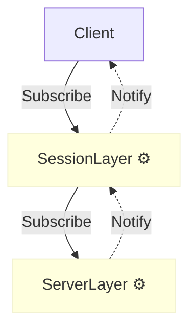
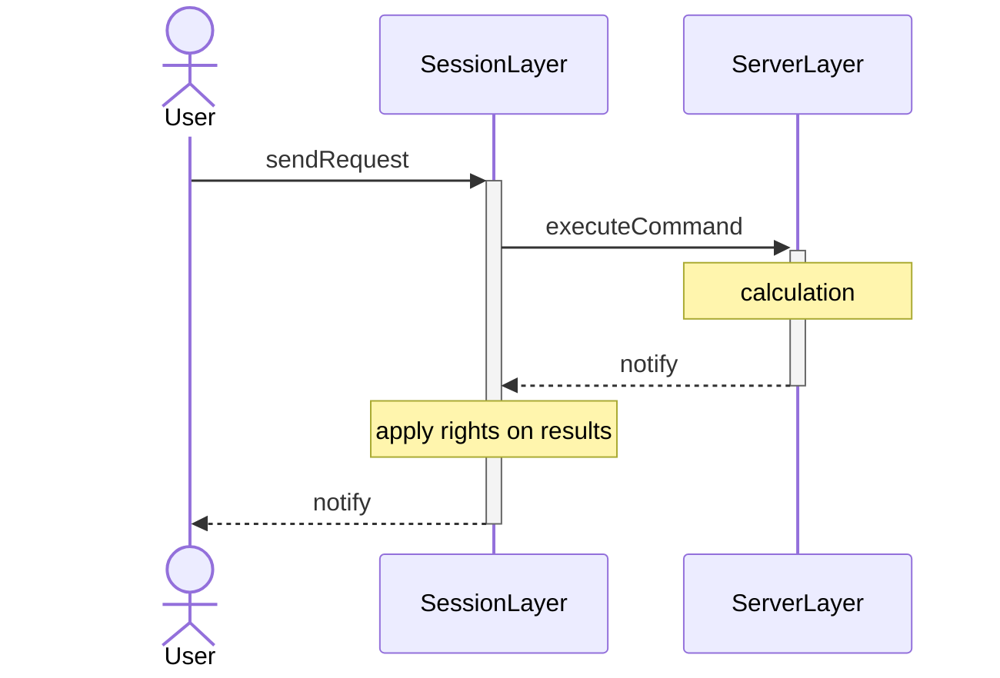
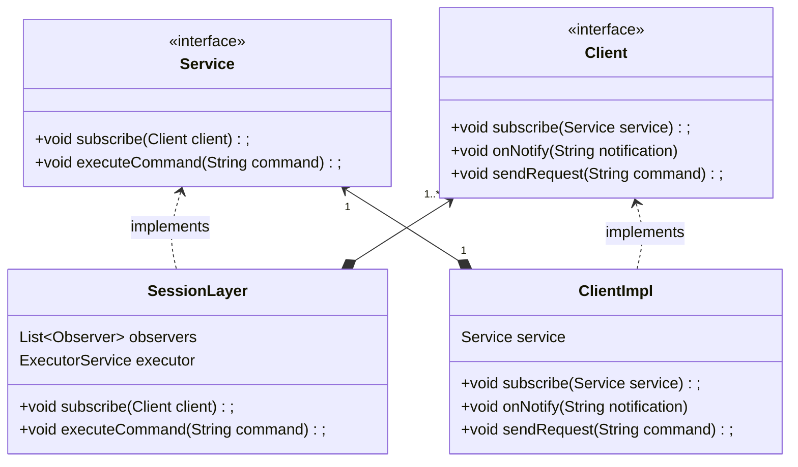
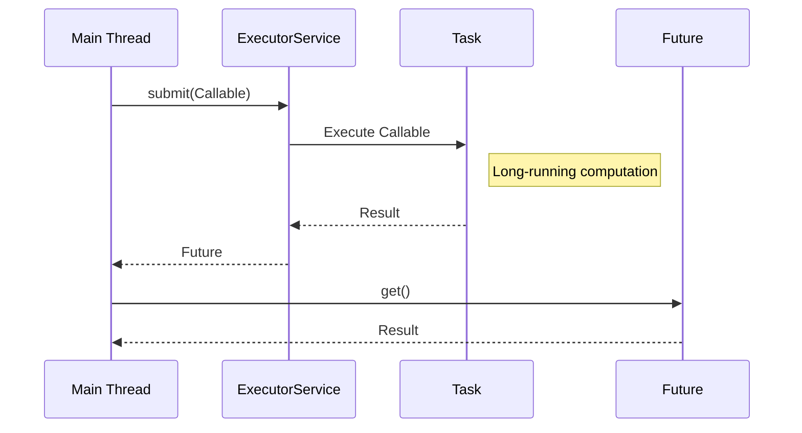
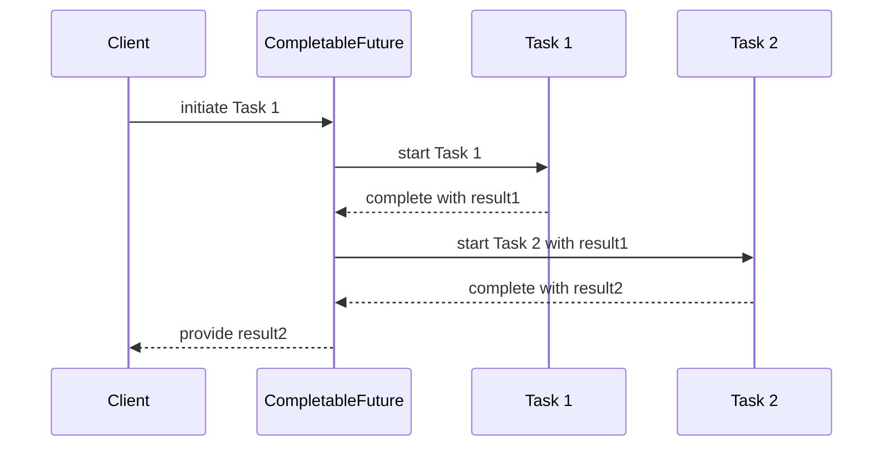
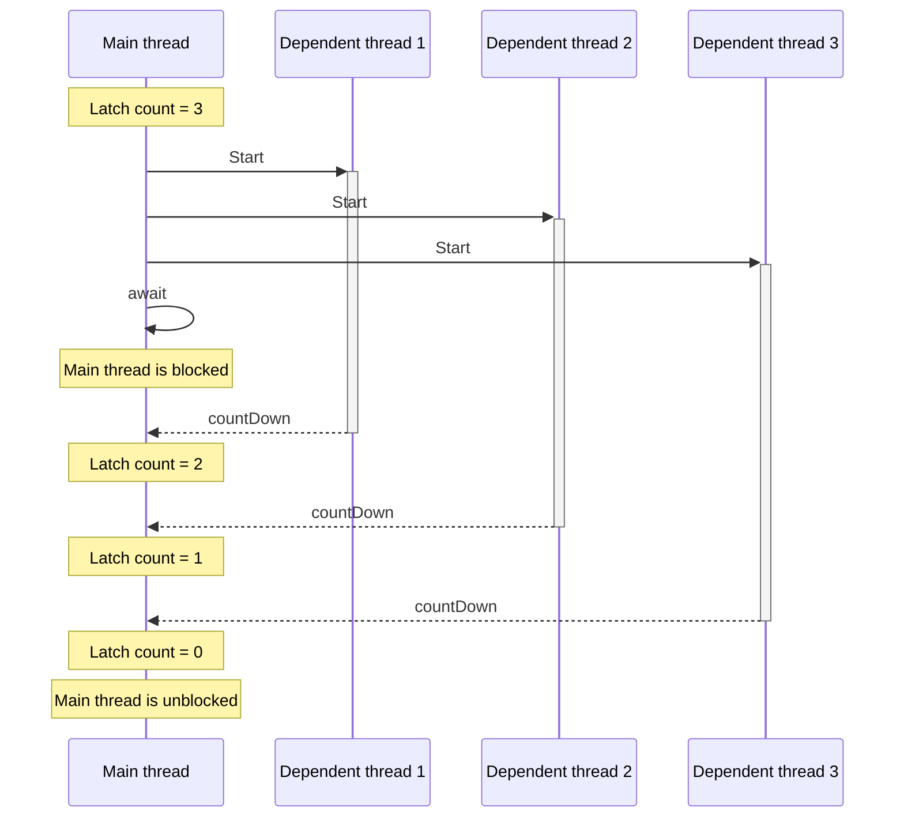

## Problem Statement

The flowchart illustrates the layered architecture of the Serve. The upper layer subscribe to lower layer and the lower
layer notify the upper layer.

- ServerLayer is used to execute command and do some calculation.
- The SessionLayer is used to apply rights.

The calculation on both layer are time-consuming. Thus, in each layer, there's a thread
pool to execute the calculation and notify the upper layer.

Our mission is to test the components SessionLayer and ServerLayer, to verify the results are calculated
correctly with the rights applied.

The following sequence diagram shows how the request are treated.

## A simplified problem:

## Concept

### How future works

### How CompletableFuture works:

CompletableFuture allow us to chain operations

### How CountDownLatch Works:

The concept of a CountDownLatch is very straightforward. Imagine it as a door that's closed initially and can be opened.
When the door is open, all threads can pass through without restriction. However, when it’s closed, all threads must
wait.

The CountDownLatch works with a counter. This counter goes down each time you call the method ‘countDown’. When it
reaches zero, the latch opens. Once a latch is open, it cannot be reset or closed again.

This concept is particularly useful during the startup of an application. At startup, several resources need to be
initialized in different threads. Once these initializations are done, the main application threads can start.

A CountDownLatch can keep track of these initialization threads and will open when the overall initialization is done.
The main application threads, waiting for the latch to open, can then proceed with their tasks, and knowing all
initializations are complete.

