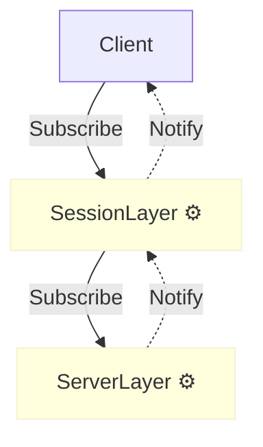
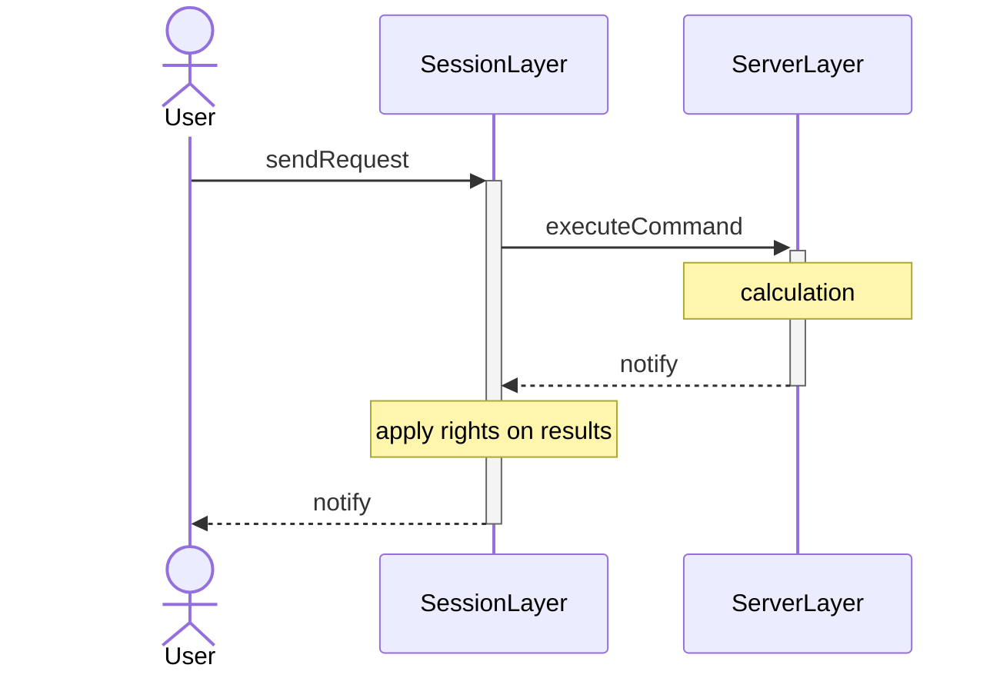
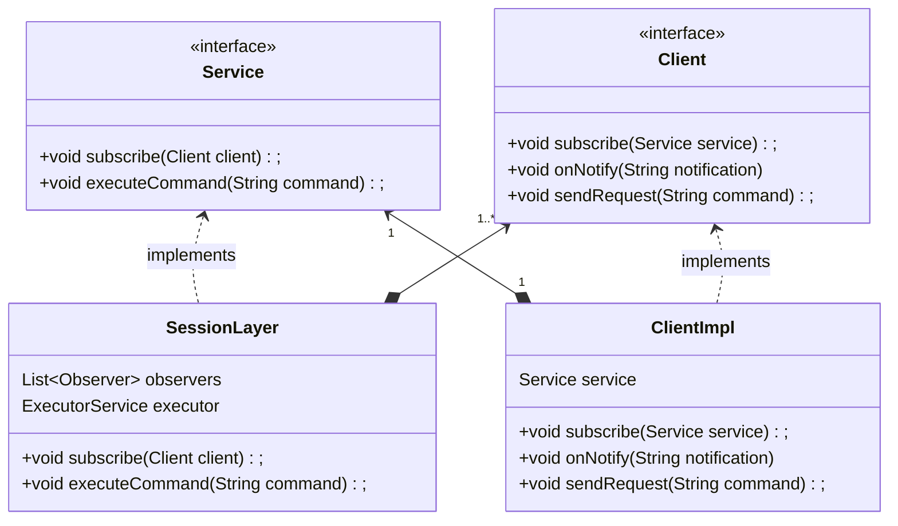
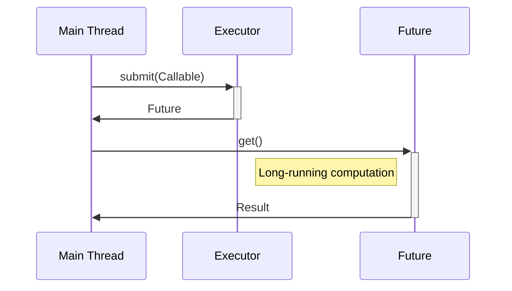
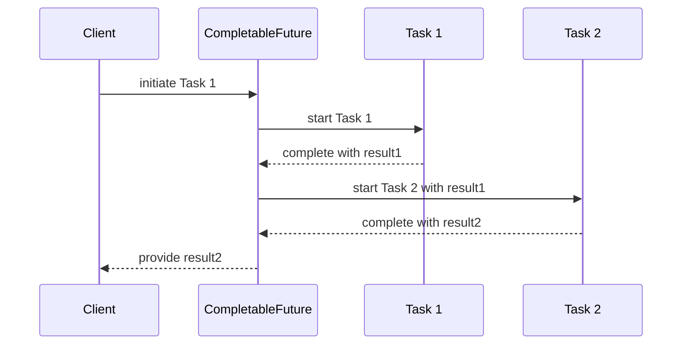
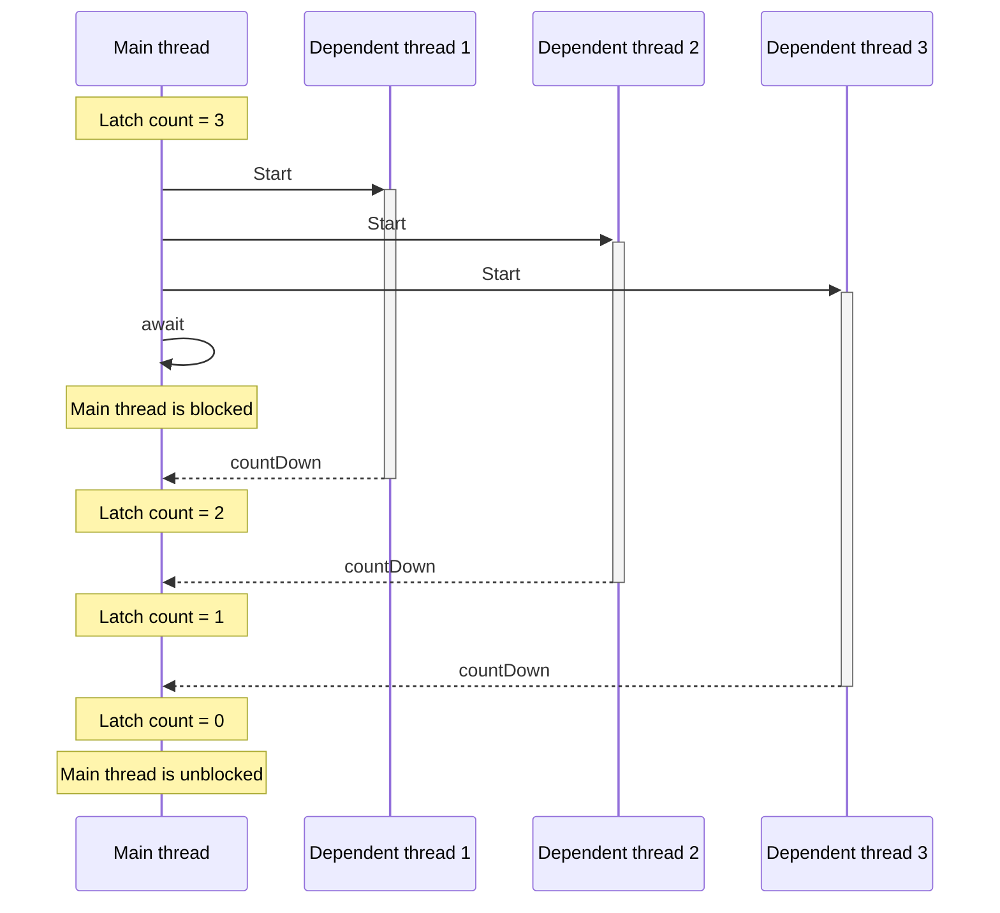

## Problem Statement

The flowchart illustrates the layered architecture of the Serve. The upper layer subscribe to lower layer and the lower
layer notify the upper layer.

- ServerLayer is used to execute command and do some calculation.
- The SessionLayer is used to apply rights.

The calculation on both layer are time-consuming. Thus, in each layer, there's a thread
pool to execute the calculation and notify the upper layer.

Our mission is to test the components SessionLayer and ServerLayer, to verify the results are calculated
correctly with the rights applied.


```mermaid
flowchart TD
    Client -->|Subscribe| SessionLayer[SessionLayer ⚙]
SessionLayer -.->|Notify|Client
SessionLayer -->|Subscribe|ServerLayer[ServerLayer ⚙️]
ServerLayer -.->|Notify|SessionLayer
classDef underTest fill: #ffffde, stroke: #f2f2d2
class SessionLayer underTest
class ServerLayer underTest
```

The following sequence diagram shows how the request are treated.


```mermaid
sequenceDiagram
    actor User
    User ->>+ SessionLayer: sendRequest
    SessionLayer ->>+ ServerLayer: executeCommand
    Note over ServerLayer: calculation
    ServerLayer -->>- SessionLayer: notify
    Note over SessionLayer: apply rights on results
    SessionLayer -->>- User: notify
```

## A simplified problem:


```mermaid
classDiagram
    class Service {
        <<interface>>
        +void subscribe(Client client);
        +void executeCommand(String command);
    }

    class Client {
        <<interface>>
        +void subscribe(Service service);
        +void onNotify(String notification)
        +void sendRequest(String command);
    }

    class SessionLayer {
        List~Observer~ observers
        ExecutorService executor
        +void subscribe(Client client);
        +void executeCommand(String command);
    }

    class ClientImpl {
        Service service
        +void subscribe(Service service);
        +void onNotify(String notification)
        +void sendRequest(String command);
    }

    Service <.. SessionLayer: implements
    Service "1" <--* "1" ClientImpl
    Client "1..*" <--* "1" SessionLayer
    Client <.. ClientImpl: implements
```

## Concept

### How the Future works

https://docs.oracle.com/javase/8/docs/api/java/util/concurrent/Future.html

The Future interface in Java represents a value that will be available at some point in the future.
It's commonly used for handling asynchronous tasks.
The two important methods of the Future interface:

- isDone(): This method checks if the computation is complete. It returns true if the task is finished, otherwise false.
- get(): This method retrieves the result of the computation once it's complete. If the computation isn't finished yet,
  this method blocks until the result is available.


```mermaid
sequenceDiagram
    participant Main Thread
    participant Executor
    Main Thread ->>+ Executor: submit(Callable)
    Executor ->>- Main Thread: Future
    Main Thread ->>+ Future: get()
    Note right of Executor: Long-running computation
    Future ->>- Main Thread: Result
```

### How the CompletableFuture works:

https://docs.oracle.com/javase/8/docs/api/java/util/concurrent/CompletableFuture.html

CompletableFuture allow us to complete the future manually. We can also chain operations


```mermaid
sequenceDiagram
    participant Client
    participant CompletableFuture
    participant Task1 as Task 1
    participant Task2 as Task 2
    Client ->> CompletableFuture: initiate Task 1
    CompletableFuture ->> Task1: start Task 1
    Task1 -->> CompletableFuture: complete with result1
    CompletableFuture ->> Task2: start Task 2 with result1
    Task2 -->> CompletableFuture: complete with result2
    CompletableFuture -->> Client: provide result2
```

### How the CountDownLatch Works:

https://docs.oracle.com/javase/8/docs/api/java/util/concurrent/CountDownLatch.html

The concept of a CountDownLatch is very straightforward. Imagine it as a door that's closed initially and can be opened.
When the door is open, all threads can pass through without restriction. However, when it’s closed, all threads must
wait.

The CountDownLatch works with a counter. This counter goes down each time you call the method ‘countDown’. When it
reaches zero, the latch opens. Once a latch is open, it cannot be reset or closed again.

This concept is particularly useful during the startup of an application. At startup, several resources need to be
initialized in different threads. Once these initializations are done, the main application threads can start.

A CountDownLatch can keep track of these initialization threads and will open when the overall initialization is done.
The main application threads, waiting for the latch to open, can then proceed with their tasks, and knowing all
initializations are complete.


```mermaid
sequenceDiagram
    participant Main thread
    participant Dependent thread 1
    participant Dependent thread 2
    participant Dependent thread 3
    Note over Main thread: Latch count = 3
    Main thread ->>+ Dependent thread 1: Start
    Main thread ->>+ Dependent thread 2: Start
    Main thread ->>+ Dependent thread 3: Start
    Main thread ->> Main thread: await
    Note over Main thread: Main thread is blocked
    Dependent thread 1 -->>- Main thread: countDown
    Note over Main thread: Latch count = 2
    Dependent thread 2 -->>- Main thread: countDown
    Note over Main thread: Latch count = 1
    Dependent thread 3 -->>- Main thread: countDown
    Note over Main thread: Latch count = 0
    Note over Main thread: Main thread is unblocked
```

## Third-party libraries

### Mockito

https://site.mockito.org/

Mockito timeout is used to wait for the mock to be invoked in another thread.

```code
verify(myMock, timeout(100)).performAction();
```

### Awaitility

https://github.com/awaitility/awaitility

```code
await()
.atMost(2,SECONDS) // Maximum wait time
.pollInterval(100,MILLISECONDS) // Polling interval
.until(() ->someCondition()); // Condition to evaluate
```

- Start Time: Awaitility records the current time when the await() call starts.
- Polling Loop: It enters a loop where it evaluates the condition at regular intervals (default or custom polling
  interval).
- Elapsed Time Check: After each condition evaluation, Awaitility calculates the elapsed time by comparing the current
  time with the recorded start time.
- Timeout Handling: If the elapsed time exceeds the specified timeout, Awaitility stops polling and throws a
  ConditionTimeoutException.


