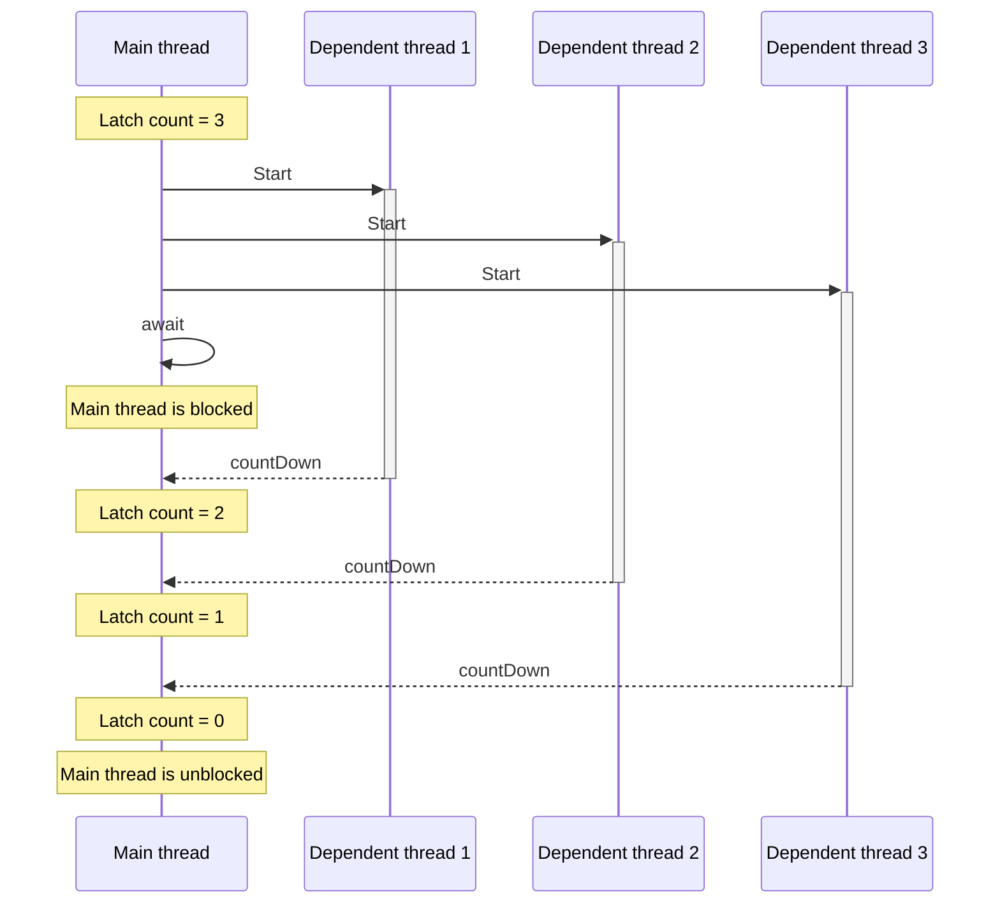

```mermaid
sequenceDiagram
    participant Main thread
    participant Dependent thread 1
    participant Dependent thread 2
    participant Dependent thread 3
    Note over Main thread: Latch count = 3
    Main thread ->>+ Dependent thread 1: Start
    Main thread ->>+ Dependent thread 2: Start
    Main thread ->>+ Dependent thread 3: Start
    Main thread ->> Main thread: await
    Note over Main thread: Main thread is blocked
    Dependent thread 1 -->>- Main thread: countDown
    Note over Main thread: Latch count = 2
    Dependent thread 2 -->>- Main thread: countDown
    Note over Main thread: Latch count = 1
    Dependent thread 3 -->>- Main thread: countDown
    Note over Main thread: Latch count = 0
    Note over Main thread: Main thread is unblocked
```